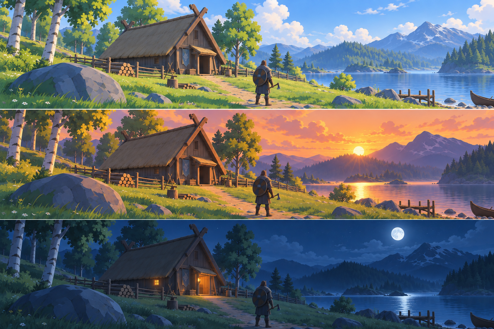

# Valheim Impact

An experimental Viking fantasy visual overhaul for Valheim, with painterly
materials, crisp artwork, and expressive lighting. The aim is a coherent world
that preserves Valheim's silhouettes, Nordic identity, weather, and gameplay
readability.

[Project tracker](https://sikbik.github.io/valheim-impact/) ·
[Source and pull requests](https://github.com/Sikbik/valheim-impact) ·
[Contributing](CONTRIBUTING.md)



Concept artwork showing a proposed day, sunset, and night palette. This is not
an in-game screenshot.

## Current scope

The project is an early, partial overhaul. Original stone, timber, and roof-atlas
artwork has passed native texture checks and a guarded main-menu fixture using
selected loaded game meshes and shaders. The runtime replaces only explicitly
listed albedo slots and preserves the original texture as a fallback.

Standard and corner straw artwork now has scoped roof UV review and native
compressed mip sampling evidence. The cutout adapter has a separate native
fixture. Actual straw appearance in the game remains unverified. Placed buildings, LOD
transitions, weather, broader biome coverage, coordinated lighting, and model
or shader streaming still need validation. See the tracker for exact asset IDs,
evidence, and unchecked stages.

Meadows grass and beech foliage, bark, stump and log candidates extend the
staged material library. Grass and logs also have isolated original-shader
comparisons at 1080p and 4K. Companion maps, world integration and visual
approval remain open; these candidates are separate from the installed fixture.

Current engine validation covers native Linux with Vulkan. Windows support and
other graphics APIs require their own tests. The Balanced target is **6 GB VRAM,
16 GB RAM at 1080p**, with crisp 4K presentation also required. These are
unmeasured targets, not minimum specifications or performance guarantees.

## Contribute

Contributions are welcome in artwork, runtime development, tools, documentation,
and reproducible testing. Start with [CONTRIBUTING.md](CONTRIBUTING.md), then read
the [project brief](docs/PROJECT_BRIEF.md) and
[art direction](docs/ART_DIRECTION.md).

For Python checks, use a virtual environment from the repository root:

```sh
python3 -m venv .venv
. .venv/bin/activate
python -m pip install -r requirements-inspection.txt
python -m unittest discover -s tests -p 'test_*.py' -v
python tools/prepare_status_site.py --check
```

The inspection requirements include the asset-processing dependencies. The test
suite uses fixtures; a game installation is not required for ordinary Python
checks or public tracker preparation. Desktop GUI tests are opt-in. See
[developer setup](docs/TECHNICAL_HANDOFF.md) for narrower workflows and optional
C# or Unity validation.

## Documentation

- [Architecture](docs/ARCHITECTURE.md): ownership and component boundaries.
- [Runtime](docs/RUNTIME.md): build configuration, exact matching, and lifecycle.
- [Unity setup](docs/UNITY_SETUP.md): native bundle authoring and validation.
- [Installer](docs/INSTALLER.md): reviewed local installation and recovery.
- [Status tracking](docs/STATUS_TRACKING.md): evidence, previews and biome controls.
- [Meadows roadmap](docs/MEADOWS_ROADMAP.md): current material batches and scene gates.

Builds and test packages are experimental. A successful source build is not a
release or a validated installation. Use the installer's preview and rollback
workflow for any local game test, and keep the game closed during file changes.

## License and asset rights

Code is available under the [MIT License](LICENSE). Project artwork is offered
under [CC BY 4.0](assets/LICENSE), with credits and scope recorded in
[artwork attribution](assets/ATTRIBUTION.md) and per-file provenance. Preserve
applicable notices and attribution when redistributing or modifying it.

Valheim Impact is an independent community project. Full game textures, extracted geometry, game assemblies and downloaded packs
are excluded. The tracker includes bounded comparative reference thumbnails,
credited separately to Iron Gate and excluded from the project artwork license.
See [comparison preview scope](docs/TRACKER_PREVIEWS.md). Contributors must have the rights to share every
file they submit under its stated license.
