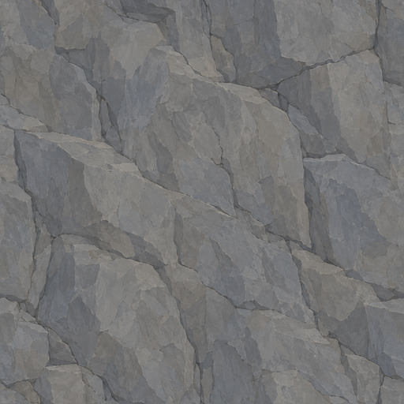
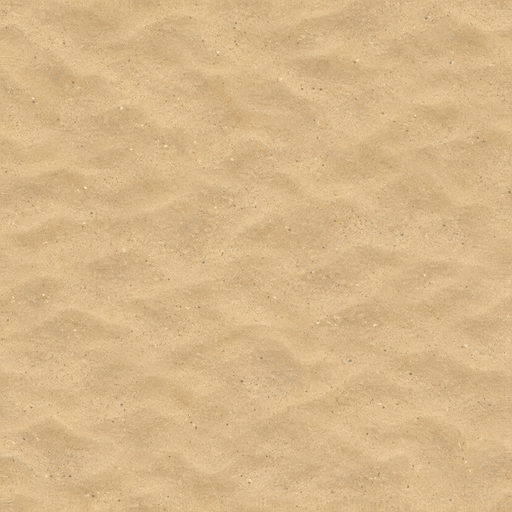

# Meadows landscape studies

Landscape work now prioritizes the surfaces that fill the view: ground, grass,
tree trunks and canopies, cliffs and shoreline sand. The first combined clearing
uses seven beech trees and both grass types over a synthetic terrain surface.
Matching original and candidate captures at 1080p and 4K make color and detail
problems easier to see together. Open the
[interactive comparisons](https://sikbik.github.io/valheim-impact/landscape/)
to move the divider and switch between views or resolutions.

The first clearing revealed overly pale bark, a busy ground pattern, coarse
terrain sampling and bright canopy highlights. The gallery includes warmer bark,
quieter turf and a separate Point/Bilinear filtering comparison. Warmer bark
improves its match with canopy branches; quieter turf and filtering reduce
visual noise and hard texture steps. Original bark normals still produce blocky
shading, and close terrain detail remains limited. This is an isolated native
study, with original game meshes and shaders, frozen wind, dry daylight and no
cast shadows. It is not a played-world scene or final lighting presentation.

Sixteen additional native frames cover the focused turf, filter and bark
revisions. Unchanged original ground, Point-filter and earlier bark controls
match their baseline image bytes. Turf v3 and bilinear filtering are separate
experiments; the gallery does not imply they have been combined. The public
gallery manifest pins each displayed image and its source capture hash.

## Cliff and shoreline sources

These original surface studies use broad gray stone planes and warm, restrained
sand grain. The full sources and independently fitted 256px, 512px and 1024px
versions are available under the artwork license.

| Cliff candidate | Shoreline sand candidate |
| --- | --- |
|  |  |

The images above are flat authored albedos, not renders or original game
textures. See the [fitting recipe](../assets/meadows/terrain-surface-recipe.json)
and [per-file provenance](../assets/provenance.json) for exact inputs and hashes.

Cliff uses diffuse-array layer 4, and shoreline sand uses layer 9. Each 256px
candidate passed an independent transient BC7 array composition with all other
diffuse layers and original normal layers preserved. Twenty-four native captures
cover two cliff orientations and a coastal transition through the original near
and distant terrain material settings. A separate twelve-frame clearing study
combines ground layer 0 with existing grass and beech candidates. The clearing
does not include the new cliff and sand replacements.

## Remaining work

- Review repeated cliff forms and sand balance alongside revised grass ground.
- Coordinate trunk, twig, leaf and grass colors under changing light.
- Compare terrain filtering and resolution without hiding added memory cost.
- Author and validate companion normals where original detail remains coarse.
- Check wet surfaces, shadows, wind, LOD transitions and other shared biomes.
- Implement bounded terrain-array loading, residency and restoration before
  installing these layers in the game.

The current terrain contract is a 256px, 16-layer, single-mip diffuse array with
Point filtering. The larger fitted sources prepare future quality options;
they do not establish a tested high-resolution array. The runtime currently
supports Texture2D albedo replacements, so these individual layers are not
installable replacements yet.

The [native evidence summary](evidence/meadows-landscape-native.json) records
capture hashes, scoped checks and remaining limitations. Lossless native capture
inputs stay local; the gallery publishes reviewed WebP copies with separate
game-content attribution. No new whole-array, biome, performance or final-art
checkmark is awarded by this study.
